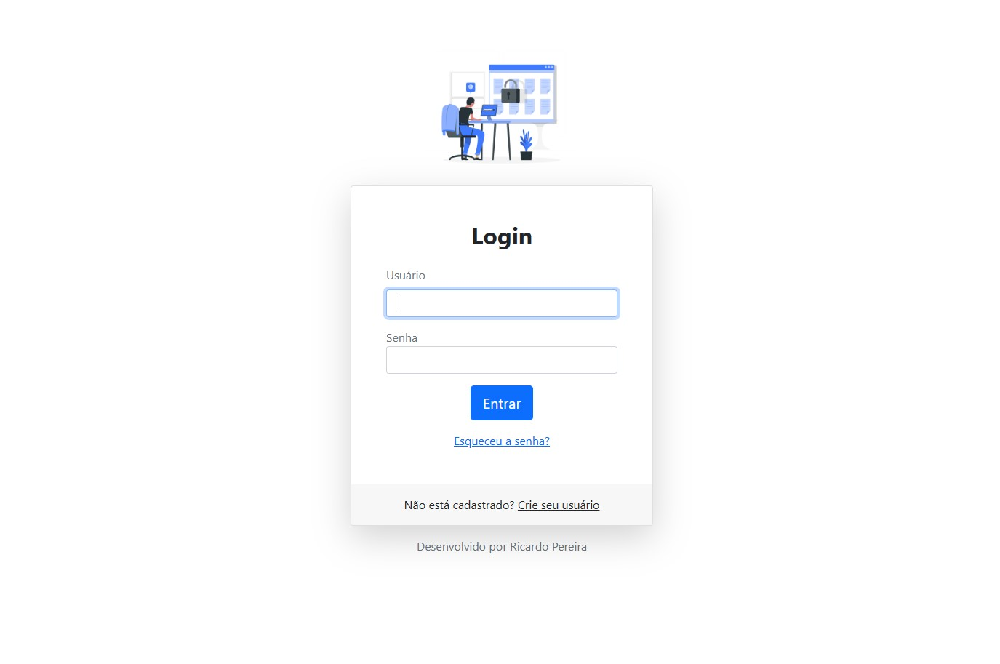
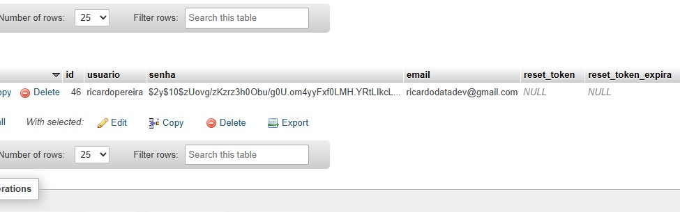

## Projeto: Sistema de Cadastro 

Este projeto tem como objetivo criar um sistema simples para cadastro e gerenciamento de uma empresa. O sistema conta com uma página de login, onde o usuário pode se cadastrar ou acessar sua conta. As informações de cadastro são salvas em um banco de dados.

Após o login, o usuário pode acessar a página de gerenciamento, onde é possível cadastrar novos equipamentos e visualizar os já registrados. O sistema permite realizar operações básicas de CRUD (Criar, Ler, Atualizar e Deletar).

A interface é simples e fácil de usar, permitindo o controle e organização dos equipamentos de maneira eficiente e prática. 

Nesse exemplo realizei um cadastro de frota no setor automotivo

